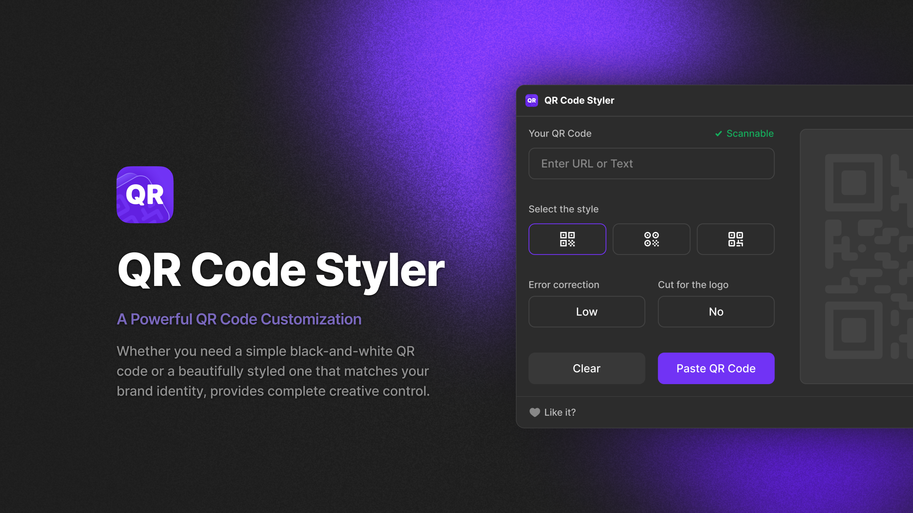

# QR Code Styler - Figma Plugin

Create beautiful, customizable QR codes directly in Figma! 

## Features

- Generate QR codes as vector SVG
- Create 520x520px frame size
- Instant generation and placement
- Auto-centering in viewport
- Clean white background
- High-quality vector output

## How to Use

1. Install the plugin from [Figma Community](https://www.figma.com/community/plugin/1483197863400441908/qr-code-styler)
2. Open your Figma project
3. Right-click → Plugins → QR Code Styler
4. Enter your text or URL
5. Click Generate
6. Your QR code will appear as a new frame in your design

## Technical Details

- Generated QR codes are vector-based (SVG)
- Default frame size: 520x520 pixels
- Automatically centers in the viewport
- Creates a new frame with white background
- QR code elements are pure black for maximum contrast

## Support

If you encounter any issues or have suggestions, please feel free to:
- Create an issue in this repository
- Contact through Figma Community plugin page

## License

This project is licensed under the MIT License - see the LICENSE file for details.